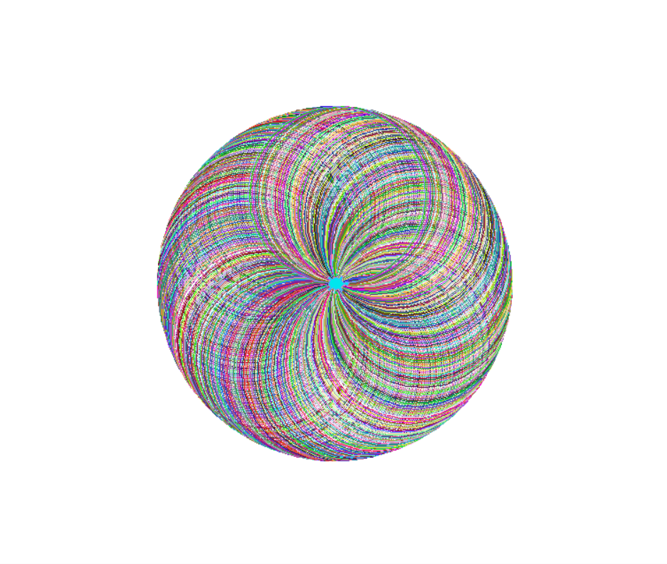

# Day 18 of 100 Days of Code
## Hirst-style Painting using *Turtle*

Today's lesson was all about getting to know the *Turtle* graphics package better. We were given a few challenges, building up to the final project of making a Damien Hirst-style artwork like this (which sell for millions):


The challenge that I most enjoyed was building the spirograph. It was so soothing to watch and the final image is just beautiful! Along the way to this, we also coded dashed lines, polygons and a random walk.

```python
from turtle import *
import random
timmy.speed("fastest")

def change_colour():
    R = random.randint(0,255)
    G = random.randint(0,255)
    B = random.randint(0,255)

    turtle.colormode(255)
    timmy.pencolor((R,G,B))

def draw_circle(size_of_gap):
    for direction in range(int(360/size_of_gap)):
        change_colour()
        timmy.circle(100)
        timmy.setheading(timmy.heading() + size_of_gap)
    
draw_circle(1)

screen = Screen()
screen.exitonclick()
```



The final project of the day used all of our skills to create an artwork like Damien Hirst. First, we used the *colorgram* package to extract colours from a particular Hirst painting we liked. These were used as the palette for our own artwork. The rest was just generating rows of randomly coloured but evenly spaced out dots. 

Am I a millionare now?